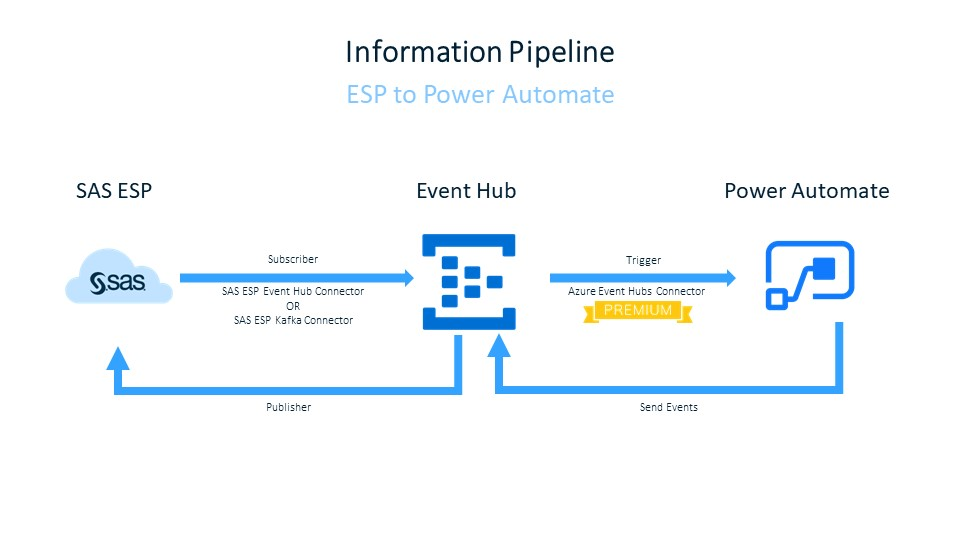
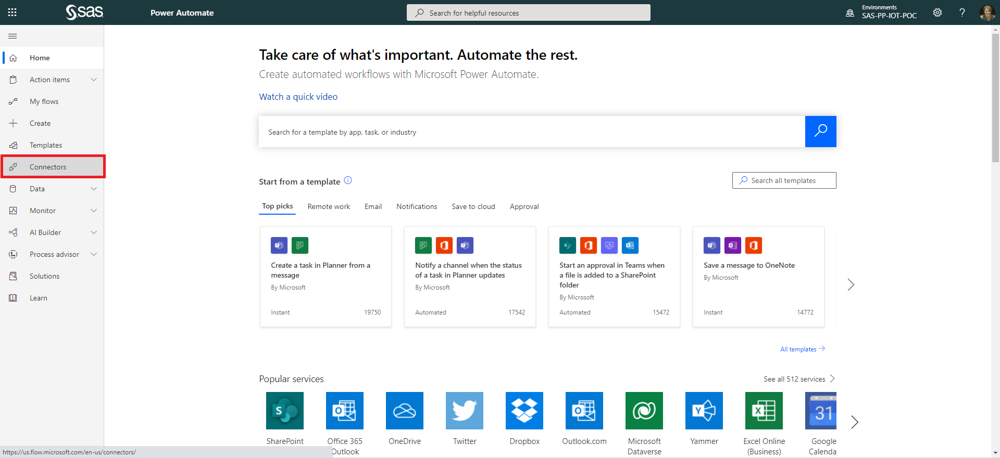
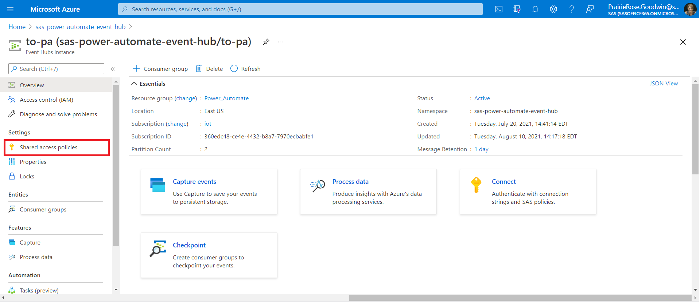
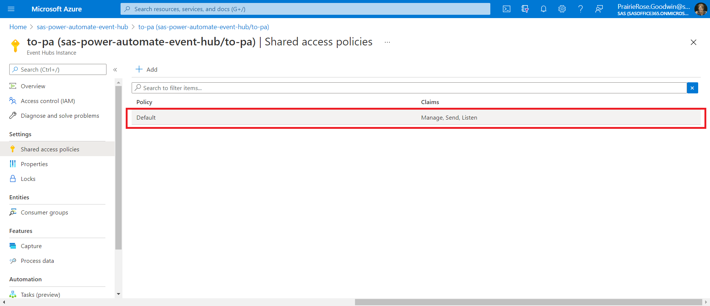
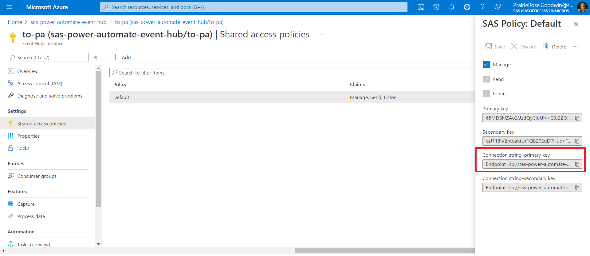
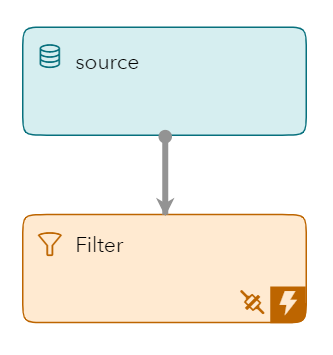
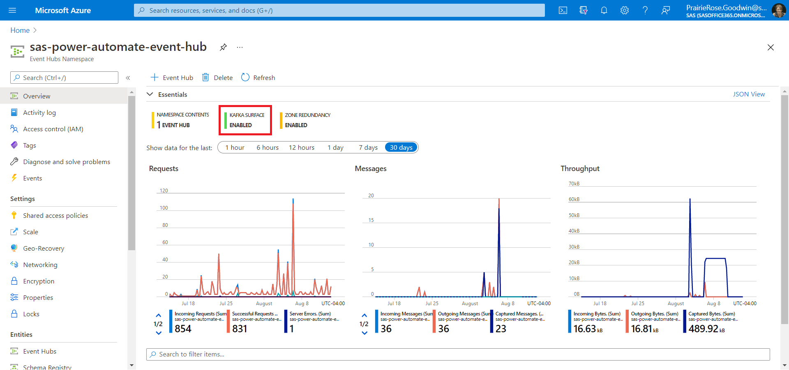
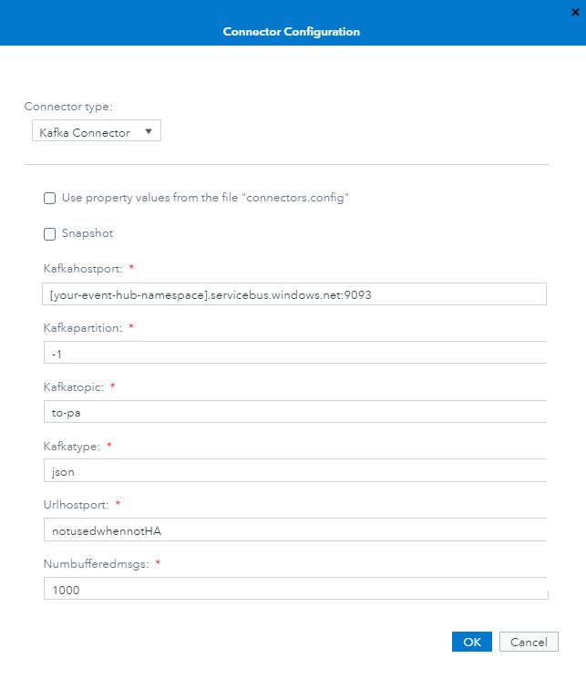
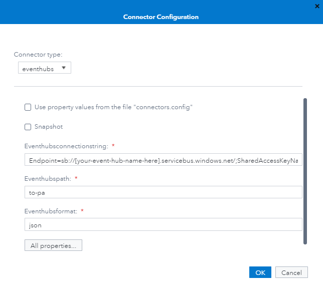

# Integration of SAS Event Stream Processing with Microsoft Power Automate and Microsoft Dynamics 365 using Microsoft Azure EventHubs

## Table of Contents
- [Overview](#overview)
- [Prerequisites](#prerequisites)
    - [ESP Studio Configuration](#esp-studio-configuration)
    - [Microsoft Azure with Eventhub](#microsoft-zzure-with-eventhub)
    - [Power Automate Configuration](#power-automate-configuration)
- [Installation](#installation)
- [Getting Started](#getting-started)
    - [Finding Your EventHubs Connection Strings](#finding-your-eventHubs-connection-strings)
    - [Connecting ESP to Azure](#connecting-esp-to-azure)
        - [The ESP Model](#the-esp-model)
        - [The Kafka Connector](#the-kafka-connector)
        - [The EventHubs Connector](#the-eventhubs-connector)
- [Contributing](#contributing)
- [License](#license)
- [Additional Resources](#additional-resources)

## Overview

You can integrate the streaming analytics available with SAS Event Stream Processing with Microsoft's Power Automate flows. This can be accomplished simply by using Microsoft Azure EventHubs to connect the two computing environments.  SAS Event Stream Processing provides two ways to connect to EventHubs: the EventHubs connector and the Kafka connector. Each of these connectors can connect to Power Automate with Microsoft's EventHubs Connector.





## Prerequisites
Four computing environments are used in this integration demo:

1. SAS Event Stream Processing Studio 
2. Microsoft Azure with Eventhub
3. Microsoft Power Automate
4. Microsoft Dynamics 365 (D365) (optional)


### SAS Event Stream Processing Studio Configuration

No preconfiguration of SAS Event Stream Processing Studio is necessary. 

### Microsoft Azure with Eventhub


**IMPORTANT**:  If you are using Kafka to connect SAS Event Stream Processing to the EventHub, then you must have a **Standard** tier or higher EventHubs Namespace in order to enable the Kafka Surface.  Alternatively, the SAS Event Stream Processing EventHubs Connector works with any tier EventHub.


Microsoft Azure has two similarly named resources: EventHubs and EventHub.  EventHubs is the outermost Namespace, which contains an EventHub Instance.  The resource that you create in the Azure Portal is the EventHubs Namespace.  After the Namespace is deployed, you can create an EventHub Instance within it.   

To set up your Microsoft Azure EventHubs Namespace and EventHub Instance, follow the instructions found in Microsoft's [Quickstart Guide](https://docs.microsoft.com/en-us/azure/event-hubs/event-hubs-create).

### Microsoft Power Automate Configuration

**IMPORTANT**: The EventHubs Connector for Microsoft Power Automate is a Premium Connector.  You must ensure that you have it added to your subscription.  


In your Microsoft Power Automate environment, you must make a new connection to your EventHubs Namespace.  From the home page of the environment, find the Connectors tab in the left hand menu. After the tab is loaded, search for the Power Automate EventHubs Connector.  Follow the instructions to complete the connection process.   




[optional] If you are connecting your flow to another environment, then you must also set up a connector here. This example uses Fin & Ops Apps for D365 to create a maintenance request. 


## Installation

All resources are located in the cloud.  No local installation is required.

## Getting Started

### Finding Your EventHubs Connection Strings
Before you start, you should locate the Primary Connection Strings for your EventHubs Namespace and your EventHub Instance.  To locate the Namespace's Primary Connection String, follow the instructions found in [Microsoft's Documentation](https://docs.microsoft.com/en-us/azure/event-hubs/event-hubs-get-connection-string)  The string should have the form: "Endpoint=sb://...;SharedAccessKeyName=...;SharedAccessKey=..."

Next, find the Primary Connection String for your EventHub Instance.  From the home screen of your EventHubs Namespace, scroll to the bottom and open the EventHub Instance that you want to connect to.  

From there, find "Shared access policies" under Settings in the lefthand menu.



You might have to create a policy if none exists.  If you already have a policy available, then clicking on it opens a new modal on the righthand side of the screen.  


Copy the "Primary Connection Key" from the modal. It should have the form: "Endpoint=sb://...;SharedAccessKeyName=...;SharedAccessKey=...;EntityPath=..." 

If the EntityPath is missing from the end of your connection string, then you have the Namespace connection string, NOT the Instance.  


### Connecting SAS Event Stream Processing to Microsoft Azure

SAS Event Stream Processing provides two ways to communicate to the Microsoft Azure cloud using an EventHub Instance as the event receiver: the Kafka adapter using Azure's built-in broker (Requires Standard Tier EventHubs Namespace or above) or the native EventHubs connector.

#### The SAS Event Stream Procssing Model
This examples uses a simple model that covers a common use case.  The model monitors a sensor and sends events that exceed a specific threshold value to Microsoft Azure in order to generate a maintenance request.  The model contains two windows, a Source window and a Filter window.  Data streams into SAS Event Stream Processing through the Source Window and the Azure connector  subscribes to output from the Filter window.  


The following code represents the model with an alert schema.  The key is a combination of the deviceid and sensorid, and the telemetry is sent through the "value" property.  The Filter window sends events with a value over 100.  



```
<contquery name="cq_01" trace="pub_win">
    <windows>
    <window-source index="pi_EMPTY" name="source">
        <schema>
        <fields>
            <field name="alert_timestamp" type="string"/>
            <field name="category" type="string"/>
            <field name="description" type="string"/>
            <field name="deviceid" type="string" key="true"/>
            <field name="inbound_timestamp" type="string"/>
            <field name="latitude" type="double"/>
            <field name="location1" type="string"/>
            <field name="location2" type="string"/>
            <field name="location3" type="string"/>
            <field name="longitude" type="double"/>
            <field name="projectname" type="string"/>
            <field name="sensorid" type="string" key="true"/>
            <field name="subcategory" type="string"/>
            <field name="value" type="double"/>
        </fields>
        </schema>
    </window-source>
    <window-filter name="Filter">
        <expression><![CDATA[value > 100]]></expression>
        <connectors>
        <!-- Our connectors go here -->
        </connector>
    </window-filter>
    </windows>
    <edges>
    <edge source="source" target="Filter"/>
    </edges>
</contquery>
```

#### The Kafka Connector 
For a more in-depth explanation of the KafkaConnector, please see the [documentation](https://go.documentation.sas.com/doc/en/espcdc/default/espca/p0sbfix2ql9xpln1l1x4t9017aql.htm).

SAS Event Stream Processing can integrate with Microsoft Azure EventHubs by leveraging the Kafka broker that is available on EventHubs at the Standard tier or higher.  If you are not sure whether you meet this criteria, then open your EventHubs Namespace in the Azure Portal.  At the top of the Overview Blade, you should see an icon that says "Kafka Surface"  If it is enabled, then you have an acceptable tier.  If not, then please upgrade your EventHubs Namespace before you continue.



SSL is required to make the connection.  SAS Event Stream Processing Studio provides a standard SSL Certificate as required by the base image, but if you have a nonstandard Linux base image then you need to review the documentation to make your connection.

To connect to your EventHub, you must set the following properties:

- Type: set this to "sub" for the project because you are subscribing to the Filter window.
- Kafkatype: set this to "json."  Type can be binary, csv , json, protobuf, avro, or the name of a string or blob field in the subscribed window schema.
- urlhostport: this properity is necessary only when you deal with high availability.  Otherwise "notusedwhennotHA"
- kafkahostport: The default Kafka port for Microsoft Azure is 9093.  Therefore, set this to [your-eventhub-namespace].servicebus.windows.net:9093.
- kafkatopic: set this to your EventHub Instance name
- kafkapartition: set this to -1 for this example.
- kafkaglobalconfig: **IMPORTANT** You need to specify the connection string to your Event Hub Instance, not your Event Hubs Namespace. The correct connection string ends in "EntityPath=[your-eventhub-instance-name]" This value can be found in the Azure Portal.  See [Finding Your EventHubs Connection Strings](#finding-your-eventHubs-connection-strings) for instructions.  

    This property specifies a semicolon-separated list of key=value strings to configure librdkafka global configuration values. If a value contains one or more semicolons, then enclose the entire value in double quotation marks.  For this example, we need the following configuration:

    security.protocol=SASL_SSL;sasl.username=$ConnectionString;sasl.password="[connectionstring endpoint for Event Hub Instance]";sasl.mechanism=PLAIN;ssl.ca.location=/etc/pki/ca-trust/extracted/openssl/ca-bundle.trust.crt
- snapshot: set this to "false" for this example
- numbufferedmsgs: set this to "1000" for this example.  
**NOTE** you cannot use the property values from connectors.config at this time.  



```
<connector class="kafka" name="kafkaout">
    <properties>
    <property name="type"><![CDATA[sub]]></property>
    <property name="kafkatype"><![CDATA[json]]></property>
    <property name="urlhostport"><![CDATA[notusedwhennotHA]]></property>
    <property name="kafkahostport"><![CDATA[[your-eventhub-namespace].servicebus.windows.net:9093]]></property>
    <property name="kafkatopic"><![CDATA[to-pa]]></property>
    <property name="kafkapartition"><![CDATA[-1]]></property>
    <property name="kafkaglobalconfig"><![CDATA[security.protocol=SASL_SSL;sasl.username=$ConnectionString;sasl.password="[connectionstring-endpoint-for-EventHub-Instance]";sasl.mechanism=PLAIN;ssl.ca.location=/etc/pki/ca-trust/extracted/openssl/ca-bundle.trust.crt]]></property>
    <property name="snapshot"><![CDATA[false]]></property>
    <property name="numbufferedmsgs"><![CDATA[1000]]></property>
    </properties>
</connector>
```


#### The EventHubs Connector
For a more in-depth explanation of the EventHubs connector, please see the [documentation](https://go.documentation.sas.com/doc/en/espcdc/Default/espwlcm/titlepage.htm).

SAS Event Stream Processing can integrate with Azure EventHubs natively through the EventHubsConnector.  To connect to your EventHubInstance, you must set the following properties:

- Type: set this to "sub" because you are subscribing to the Filter window.
- Snapshot: set this to true or false, depending on your needs.
- Eventhubsconnectionstring: **IMPORTANT** You need to specify the connection string to your EventHub Instance, not your EventHubs Namespace.  The correct connection string ends with "EntityPath=[your-eventhub-instance-name]"  This value can be found in the Azure Portal.  See [Finding Your EventHubs Connection Strings](#finding-your-eventHubs-connection-strings) for instructions.
- Eventhubspath: set this to the name of your Event Hub Instance
- Eventhubsformat: this can be JSON or CSV.  For this example, specify "json."  

**NOTE** You cannot use the property values from connectors.config at this time.  




For a more in-depth explanation of the EventHubs connector, please see the SAS Event Stream Processing documentation.

The completed connector is as follows.  

```
<connectors>
    <connector class="eventhubs" name="evHub">
      <properties>
        <property name="type"><![CDATA[sub]]></property>
        <property name="snapshot"><![CDATA[false]]></property>
        <property name="eventhubsconnectionstring"><![CDATA[[connectionstring-endpoint-for-EventHub-Instance]]]></property>
        <property name="eventhubspath"><![CDATA[your-eventhubs-instance-name]]></property>
        <property name="eventhubsformat"><![CDATA[json]]></property>
      </properties>
    </connector>
  </connectors>
```

## Contributing


We welcome your contributions! Please read [CONTRIBUTING.md](CONTRIBUTING.md) for details on how to submit contributions to this project. 

## License


This project is licensed under the [Apache 2.0 License](LICENSE).

## Additional Resources

**Required**. Include any additional resources that users may need or find useful when using your software. Additional resources might include the following:

* [Azure Portal](https://portal.azure.com/)
* [Power Automate](https://us.flow.microsoft.com)
* [SAS ESP Documentation](https://go.documentation.sas.com/doc/en/espcdc/Default/espwlcm/titlepage.htm)
* [Azure EventHubs Resource](https://azure.microsoft.com/en-us/services/event-hubs/#overview)
* [Azure EventHubs Documentation](https://docs.microsoft.com/en-us/azure/event-hubs/)
* [Power Automate Documentation](https://docs.microsoft.com/en-us/power-automate/)
